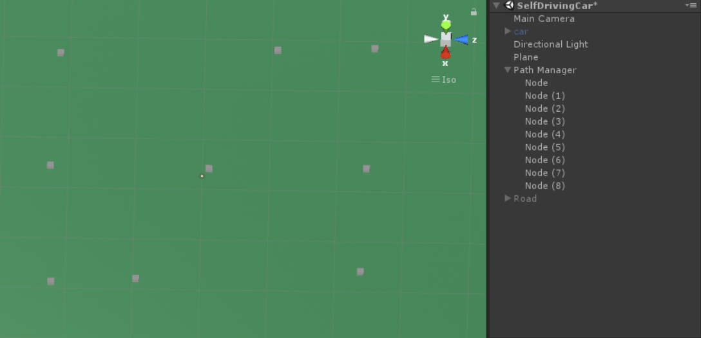
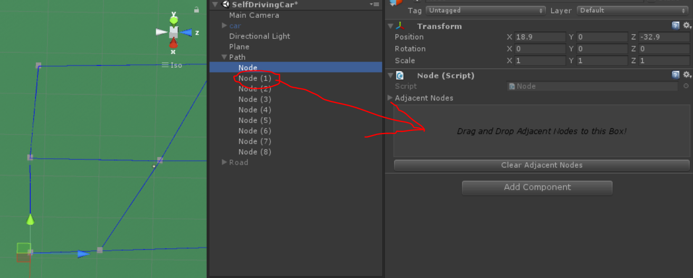
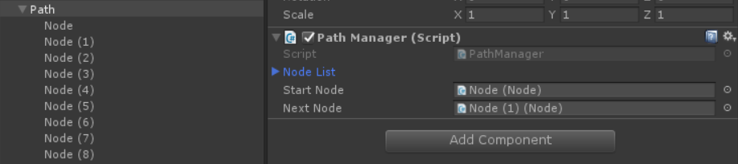

Sample project for a self-driving car which randomly choose the target node at every cross.

Usage:
1. Create PathManger object and add some Nodes as children.        

2. Connect nodes by dragging one node and dropping in the other node's drag&drop box.      

3. Set start node and next node.   

4. Attach SelfDriving script to your car and click play!      

Final effect:   

